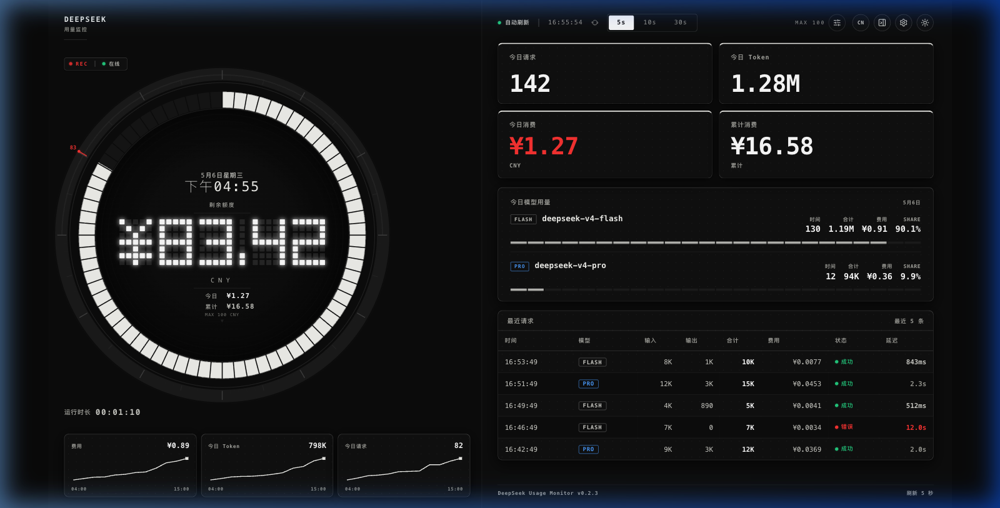
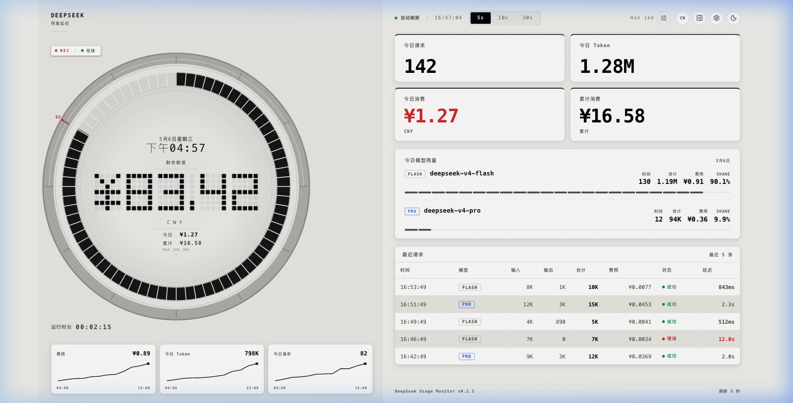

# DeepSeek Usage Monitor

A local-first DeepSeek usage and balance monitoring dashboard built with React, TypeScript, Vite, Tailwind CSS, and FastAPI.

一个本地优先的 DeepSeek API 用量与余额监控仪表盘，基于 React、TypeScript、Vite、Tailwind CSS 和 FastAPI 构建。

---

## Preview / 预览


*Dark Mode Dashboard with mock data / 暗色模式仪表盘（模拟数据）*


*Light Mode Dashboard with mock data / 亮色模式仪表盘（模拟数据）*

---

## Overview / 项目简介

### English
DeepSeek Usage Monitor is a high-fidelity, "Nothing-inspired" industrial dashboard designed for developers to monitor their DeepSeek API consumption in real-time. It provides a visual overview of account balance, model usage, and cost estimates, all while keeping your data local and secure.

### 中文
DeepSeek Usage Monitor 是一款高保真、“Nothing 风格”的工业风仪表盘，专为开发者设计，用于实时监控 DeepSeek API 消耗情况。它提供了账户余额、模型用量和成本估算的可视化概览，同时确保您的数据保留在本地，安全可靠。

---

## Features / 功能特性

- **Real-time Balance**: Visual tracking of DeepSeek account balance (CNY).
- **Industrial Gauge**: Custom 5x7 dot-matrix LED display for balance reading.
- **Model Breakdown**: Detailed usage statistics for different models (Flash, Pro, etc.).
- **Trend Visualization**: Mini sparklines for spend, tokens, and requests.
- **Request Log**: Real-time log of recent API requests with latency and status.
- **Local Persistence**: Settings and API keys are stored only on your machine.
- **Bilingual UI**: Full support for English and Chinese (简体中文).
- **Theme Support**: Seamless switching between industrial Light and Dark modes.

---

## Tech Stack / 技术栈

- **Frontend**: React 19, TypeScript, Vite, Tailwind CSS, Lucide Icons.
- **Backend**: Python 3.10+, FastAPI, Uvicorn, HTTPX.
- **Design**: "Nothing" industrial aesthetic with custom SVG components.

---

## Architecture / 架构说明

The project follows a standard decoupled full-stack architecture:
- **Frontend**: A single-page application (SPA) that polls the local backend.
- **Backend**: A lightweight FastAPI server that proxies requests to the DeepSeek API and manages local settings.

项目采用标准的前后端分离架构：
- **前端**：一个单页应用（SPA），定期轮询本地后端接口。
- **后端**：一个轻量级的 FastAPI 服务器，代理 DeepSeek API 请求并管理本地设置。

---

## Quick Start / 快速开始

### macOS
1. Download or clone this repository.
2. Double-click **`start-mac.command`**.
   - If blocked by macOS, run `chmod +x start-mac.command` in Terminal.
3. Open **http://localhost:5173** in your browser.
4. Go to **Settings** (⚙ icon) and enter your **DeepSeek API Key**.

### Windows
1. Download or clone this repository.
2. Double-click **`start-windows.bat`**.
3. Two windows will open (Backend & Frontend).
4. Open **http://localhost:5173** in your browser.
5. Go to **Settings** (⚙ icon) and enter your **DeepSeek API Key**.

---

## Manual Setup / 手动启动

### Backend / 后端
```bash
cd backend
python3 -m venv .venv
source .venv/bin/activate  # Windows: .venv\Scripts\activate
pip install -r requirements.txt
uvicorn main:app --port 8789 --reload
```

### Frontend / 前端
```bash
npm install
npm run dev
```

---

## Environment Variables / 环境变量

The backend reads from `backend/.env`. A template is provided in `backend/.env.example`.

| Variable | Description |
|----------|-------------|
| `DEEPSEEK_API_KEY` | Your DeepSeek API key (sk-...). |
| `INITIAL_TOTAL_CREDIT_CNY` | Optional baseline for estimating total spend. |

**Important**: Never commit your real `.env` file or API key to GitHub.

---

## Data & Calculation Notes / 数据与计算口径

### Total Spend / 累计消费
**English**: Due to current API limitations, DeepSeek does not provide an official cumulative spend field. Total Spend is estimated using:
`historical_total_spend = initial_total_credit - current_total_balance`
Set your **Initial Total Credit** in the Settings panel to match your total top-up history.

**中文**: 由于当前 API 限制，DeepSeek 不直接提供官方累计消费字段。本项目中的“累计消费”基于以下公式估算：
`累计消费 = 初始总额度 - 当前账户余额`
请在设置面板中配置您的 **初始总额度**（即您的历史充值总额），以获得准确的估算。

---

## Security Notes / 安全说明

- **Local Secrets**: Your API key is stored only in `backend/local_settings.json` or `.env` on your local machine.
- **Zero Telemetry**: No usage data is ever uploaded to any third-party server besides DeepSeek.
- **Masked Input**: API keys are handled as sensitive password fields in the UI.

---

## Roadmap / 路线图

- [ ] Support for monthly usage breakdown (SQLite logging).
- [ ] Multi-account management.
- [ ] Exportable usage reports (PDF/CSV).

---

## Disclaimer / 免责声明

This is an unofficial third-party tool and is not affiliated with DeepSeek. Use it at your own risk.

本项目为第三方工具，非 DeepSeek 官方出品。请在遵守 DeepSeek API 使用条款的前提下使用。

---

## License / 许可证

MIT License
