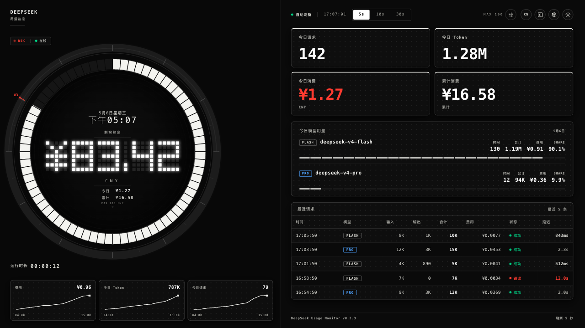

# DeepSeek Usage Monitor

A local-first DeepSeek usage and balance monitoring dashboard built with React, TypeScript, Vite, Tailwind CSS, and FastAPI.

一个本地优先的 DeepSeek API 用量与余额监控仪表盘，基于 React、TypeScript、Vite、Tailwind CSS 和 FastAPI 构建。

[English](#english) | [中文](#中文)

## Preview / 预览



Demo dashboard screenshot with mock data. No real API key, account, balance, or personal information is shown.

演示截图使用模拟数据，不包含真实 API key、真实账号、真实余额或个人敏感信息。

## English

### Overview

DeepSeek Usage Monitor is a local dashboard for viewing DeepSeek API balance, estimated spend, request activity, token usage, and model-level usage breakdowns. It is designed for developers who want a focused desktop-style monitor while keeping credentials on their own machine.

This project is not positioned as a production-ready billing system. Data can come from the local backend, local settings, or built-in mock/demo data depending on how it is started and configured.

### Features

- Balance dashboard with an industrial gauge-style display.
- Today metrics for requests, tokens, and estimated spend.
- Model usage breakdown with request counts, token totals, estimated cost, and share.
- Recent request table for latency, status, tokens, and estimated cost.
- Light and dark themes.
- English and Simplified Chinese UI support.
- Local-first backend proxy for DeepSeek API access.

### Tech Stack

- Frontend: React, TypeScript, Vite, Tailwind CSS, Lucide React.
- Backend: Python >= 3.10, FastAPI, Uvicorn, HTTPX.
- Tooling: npm scripts for frontend development and production builds.

### Architecture

The app uses a decoupled local frontend/backend architecture.

- Frontend: a Vite-powered React single-page app that renders the dashboard and polls the local backend.
- Backend: a FastAPI service that reads local configuration, keeps secrets out of the frontend bundle, and proxies supported DeepSeek API requests.
- Demo/mock data: the frontend includes mock data so the dashboard can render a safe preview when live backend data is unavailable.

### Native Apple App

An experimental pure SwiftUI Apple app lives in `AppleApp/`.

- Open `AppleApp/DeepSeekUsageMonitor.xcodeproj` in Xcode.
- Use the `DeepSeekUsageMonitor macOS` scheme to run locally on Mac.
- Use the `DeepSeekUsageMonitor iOS` scheme to run on an iPhone simulator or a signed iPhone device.
- The native app stores the DeepSeek API key in the device Keychain and stores non-secret preferences in `UserDefaults`.
- The native app no longer needs the Vite frontend or FastAPI backend at runtime; it calls the DeepSeek balance endpoint directly and keeps the existing request/model panels as mock data for the first native version.
- The iOS target now embeds a WidgetKit Home Screen widget extension, `DeepSeekUsageMonitorWidgetExtension`, with small, medium, and large layouts.
- The widget does not store or read the API key. The main app fetches the live DeepSeek balance with the Keychain-stored key, writes a non-secret snapshot to the App Group `group.com.local.DeepSeekUsageMonitor`, and asks WidgetKit to reload after each app refresh.
- For real iPhone installation, the iOS app target and widget extension must use the same signing team and the same App Group capability. WidgetKit may still throttle background timeline refreshes when the app is not running.

### Prerequisites

Install these before using the local launcher scripts:

- Python >= 3.10.
- Node.js 22 LTS recommended, or Node.js 20.19+ / 22.12+.
- npm, usually bundled with Node.js.
- Internet access for the first `npm install` and `pip install`.

### Quick Start

1. Clone the repository.
2. After installing the prerequisites, use the local launcher for your platform:

```bash
# macOS
chmod +x start-mac.command
./start-mac.command

# Windows
start-windows.bat
```

On macOS, if double-clicking is blocked, run the command in Terminal or right-click the file and choose Open.

On Windows, double-click `start-windows.bat`, or run it from CMD/PowerShell in the project folder.

3. Before connecting a real DeepSeek API key, review `backend/.env` or create it from `backend/.env.example`.

Manual startup uses two terminal sessions.

Terminal 1 - backend:

```bash
cd backend
python3 -m venv .venv
source .venv/bin/activate
pip install -r requirements.txt
uvicorn main:app --host 127.0.0.1 --port 8789 --reload
```

Terminal 2 - frontend:

```bash
npm install
npm run dev
```

### Frontend Setup

```bash
npm install
npm run dev
```

Build for production:

```bash
npm run build
```

Type-check only:

```bash
npx tsc --noEmit
```

### Backend Setup

Python >= 3.10 is required because the backend uses Python 3.10+ type syntax. On macOS, `python3.10` or `python3.11` is recommended.

Create a backend environment file from the example:

```bash
cp backend/.env.example backend/.env
```

Then set your DeepSeek API key in `backend/.env`.

Typical backend startup:

```bash
cd backend
python3 -m venv .venv
source .venv/bin/activate
pip install -r requirements.txt
uvicorn main:app --host 127.0.0.1 --port 8789 --reload
```

On Windows, activate the virtual environment with:

```bash
cd backend
.venv\Scripts\activate
```

### One-click Scripts

The repository includes platform helper scripts for local startup after prerequisites are installed:

- macOS: `start-mac.command`
- Windows: `start-windows.bat`

These scripts are intended as local convenience wrappers. Review and configure `backend/.env` before connecting a real API key.

### Troubleshooting

- Python version too low: install Python >= 3.10, then delete any old `backend/.venv` created with an older Python and rerun the launcher.
- Node version too low: install Node.js 22 LTS, or Node.js 20.19+ / 22.12+.
- Backend offline / port 8789: start the backend with `uvicorn main:app --host 127.0.0.1 --port 8789 --reload` from the `backend` directory, or use the launcher script.
- `npm install` or `pip install` fails: check your internet connection, proxy, and package registry access, then rerun the launcher.
- macOS permission denied for `start-mac.command`: run `chmod +x start-mac.command`, then run `./start-mac.command`.
- Windows batch window closes immediately: open CMD/PowerShell in the project folder and run `start-windows.bat` so the error stays visible.

### Environment Variables

The backend reads secrets from `backend/.env`. The committed template is `backend/.env.example`.

| Variable | Required | Description |
|---|---|---|
| `DEEPSEEK_API_KEY` | Yes, for live API access | Your DeepSeek API key. Keep it only in `backend/.env`. |
| `INITIAL_TOTAL_CREDIT_CNY` | Optional | User-configured baseline used to estimate total spend. |

Do not put the DeepSeek API key into any frontend `VITE_` variable. Frontend environment variables are exposed to the browser bundle. Do not commit a real `.env` file. Only `.env.example` should be committed.

### Data & Calculation Notes

Due to current API limitations, total spend is estimated from a user-configured initial balance minus current balance, rather than retrieved as an official cumulative billing field.

Formula:

```text
Total Spend = Initial Total Credit CNY - Current Balance CNY
```

This value is useful for local monitoring, but it should not be treated as an official DeepSeek billing statement.

### Security Notes

- Keep `DEEPSEEK_API_KEY` only in `backend/.env`.
- Do not place real secrets in frontend `VITE_` variables.
- Do not commit real `.env` files, screenshots with account data, logs, or other sensitive local artifacts.
- Use `backend/.env.example` as the only committed environment template.
- The dashboard screenshot in this README uses mock/demo data only.

### Roadmap

- Monthly and historical usage views.
- Local persistence for usage history.
- Exportable reports.
- Multi-account workflows.
- Remaining React Hooks lint maintenance items.

### Disclaimer

This is an unofficial third-party tool and is not affiliated with DeepSeek. API availability, billing fields, and balance semantics may change. Verify important billing information with official DeepSeek sources.

### License

Paid proprietary license. This project is not open source and is not free to use.
Use, copying, distribution, commercial use, hosted use, and derivative works
require a separate written paid license from the copyright holder. See
`LICENSE`.

## 中文

### 项目简介

DeepSeek Usage Monitor 是一个本地优先的 DeepSeek API 用量与余额监控仪表盘，用于查看账户余额、估算消费、请求活动、Token 用量以及模型维度的使用占比。它更适合个人开发者在本机做日常观察，而不是替代官方账单系统。

根据启动方式与配置不同，页面数据可能来自本地后端、本地设置，或项目内置的 mock/demo 数据。

### 功能特性

- 仪表盘式余额展示。
- 今日请求数、Token 数与估算消费。
- 按模型展示请求数、Token 总量、估算费用和占比。
- 最近请求列表，包含延迟、状态、Token 与估算费用。
- 深色与浅色主题。
- 英文与简体中文界面。
- 本地 FastAPI 后端代理 DeepSeek API，避免把密钥暴露到前端。

### 技术栈

- 前端：React、TypeScript、Vite、Tailwind CSS、Lucide React。
- 后端：Python >= 3.10、FastAPI、Uvicorn、HTTPX。
- 工具链：npm scripts 用于前端开发、类型检查与构建。

### 架构说明

项目采用本地前后端分离架构。

- 前端：基于 Vite 的 React 单页应用，负责渲染仪表盘并轮询本地后端。
- 后端：FastAPI 服务，负责读取本地配置、隔离密钥，并代理支持的 DeepSeek API 请求。
- 演示数据：前端包含 mock 数据，因此在没有真实后端数据时也可以展示安全的 dashboard 预览。

### 原生 Apple App

项目已新增实验性的纯 SwiftUI 原生 Apple App，位于 `AppleApp/`。

- 在 Xcode 中打开 `AppleApp/DeepSeekUsageMonitor.xcodeproj`。
- 使用 `DeepSeekUsageMonitor macOS` scheme 在 Mac 本机运行。
- 使用 `DeepSeekUsageMonitor iOS` scheme 在 iPhone 模拟器或已签名真机上运行。
- 原生 app 将 DeepSeek API 密钥保存到本机 Keychain，其他非敏感偏好保存到 `UserDefaults`。
- 原生 app 运行时不再依赖 Vite 前端或 FastAPI 后端；它会直接请求 DeepSeek 余额接口，首版仍保留请求/模型面板为 mock 数据。
- iOS target 现在内嵌了 WidgetKit 主屏幕小组件扩展：`DeepSeekUsageMonitorWidgetExtension`，支持小、中、大三种尺寸。
- Widget 不保存也不读取 API key。主 app 使用 Keychain 中的密钥获取 DeepSeek 真实余额，再把不含密钥的快照写到 App Group `group.com.local.DeepSeekUsageMonitor`，并在每次 app 刷新后通知 WidgetKit 重新加载。
- 真机安装时，iOS app target 和 Widget extension 需要使用同一个签名 Team，并启用同一个 App Group capability。app 不运行时，WidgetKit 仍可能按系统策略降低后台时间线刷新频率。

### 前置依赖

使用本地启动脚本前，请先安装：

- Python >= 3.10。
- 推荐 Node.js 22 LTS，或 Node.js 20.19+ / 22.12+。
- npm，通常随 Node.js 一起安装。
- 首次执行 `npm install` 和 `pip install` 需要网络连接。

### 快速开始

1. 克隆本仓库。
2. 安装前置依赖后，使用对应平台的本地启动脚本：

```bash
# macOS
chmod +x start-mac.command
./start-mac.command

# Windows
start-windows.bat
```

macOS 如果双击被系统拦截，可以在 Terminal 中运行命令，或右键文件后选择打开。

Windows 可以双击 `start-windows.bat`，也可以在项目目录的 CMD/PowerShell 中运行。

3. 连接真实 DeepSeek API key 前，请先检查 `backend/.env`，或根据 `backend/.env.example` 创建。

手动启动需要两个终端。

终端 1 - 后端：

```bash
cd backend
python3 -m venv .venv
source .venv/bin/activate
pip install -r requirements.txt
uvicorn main:app --host 127.0.0.1 --port 8789 --reload
```

终端 2 - 前端：

```bash
npm install
npm run dev
```

### 前端启动

```bash
npm install
npm run dev
```

生产构建：

```bash
npm run build
```

仅运行类型检查：

```bash
npx tsc --noEmit
```

### 后端启动

后端使用 Python 3.10+ 类型语法，因此需要 Python >= 3.10。macOS 推荐使用 `python3.10` 或 `python3.11`。

先从示例文件创建本地环境变量文件：

```bash
cp backend/.env.example backend/.env
```

然后在 `backend/.env` 中填写你的 DeepSeek API key。

常见后端启动方式：

```bash
cd backend
python3 -m venv .venv
source .venv/bin/activate
pip install -r requirements.txt
uvicorn main:app --host 127.0.0.1 --port 8789 --reload
```

Windows 下可使用：

```bash
cd backend
.venv\Scripts\activate
```

### 一键启动脚本

安装前置依赖后，仓库内包含本地启动辅助脚本：

- macOS：`start-mac.command`
- Windows：`start-windows.bat`

这些脚本只是本地启动便利工具。连接真实 API key 前，请先检查并配置 `backend/.env`。

### 常见问题

- Python 版本过低：安装 Python >= 3.10；如果旧版本已经创建过 `backend/.venv`，请删除该目录后重新运行启动脚本。
- Node 版本过低：安装 Node.js 22 LTS，或 Node.js 20.19+ / 22.12+。
- 后端离线 / 8789 端口：在 `backend` 目录运行 `uvicorn main:app --host 127.0.0.1 --port 8789 --reload`，或使用启动脚本。
- `npm install` 或 `pip install` 失败：检查网络、代理和包 registry 访问后重新运行启动脚本。
- macOS 提示 `start-mac.command` permission denied：先运行 `chmod +x start-mac.command`，再运行 `./start-mac.command`。
- Windows 批处理窗口瞬间关闭：在项目目录打开 CMD/PowerShell，运行 `start-windows.bat` 以查看错误信息。

### 环境变量

后端从 `backend/.env` 读取密钥。仓库中提交的模板文件是 `backend/.env.example`。

| 变量 | 是否必需 | 说明 |
|---|---|---|
| `DEEPSEEK_API_KEY` | 连接真实 API 时必需 | DeepSeek API key，只应放在 `backend/.env`。 |
| `INITIAL_TOTAL_CREDIT_CNY` | 可选 | 用于估算 Total Spend 的用户配置初始额度。 |

不要把 DeepSeek API key 放进任何前端 `VITE_` 变量。前端环境变量会进入浏览器 bundle。不要提交真实 `.env` 文件；仓库中只应提交 `.env.example`。

### 数据与计算口径

由于当前 API 不直接提供官方累计消费字段，本项目中的 Total Spend 基于用户配置的初始额度与当前余额差额进行估算，并非官方账单口径。

公式：

```text
Total Spend = 初始总额度 CNY - 当前余额 CNY
```

这个数值适合本地监控参考，不应视为 DeepSeek 官方账单。

### 安全说明

- `DEEPSEEK_API_KEY` 只应放在 `backend/.env`。
- 不要把真实密钥放入前端 `VITE_` 变量。
- 不要提交真实 `.env`、包含账号信息的截图、日志或其他本地敏感文件。
- 仓库中只提交 `backend/.env.example` 作为环境变量模板。
- README 中的 dashboard 截图仅使用 mock/demo 数据。

### 路线图

- 月度与历史用量视图。
- 本地用量历史持久化。
- 导出报表。
- 多账号工作流。
- 剩余 React Hooks lint 维护项。

### 免责声明

本项目是非官方第三方工具，与 DeepSeek 官方无关联。API 可用性、账单字段和余额口径可能变化，重要账单信息请以 DeepSeek 官方来源为准。

### 许可证

付费专有授权。本项目不是开源免费项目。使用、复制、分发、商业使用、
托管服务使用和衍生作品均需要先获得版权持有者的单独书面付费授权。
详见 `LICENSE`。
